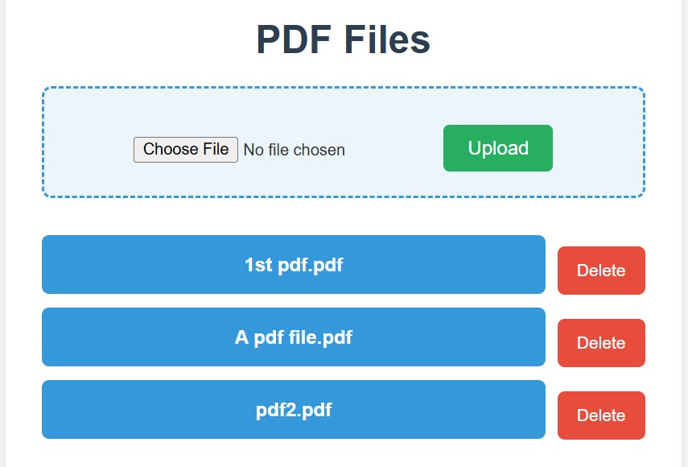

# Flask PDF Server

A small Flask web app for uploading, listing, downloading, and deleting PDF files.

The goal of this app was to set up a practical Flask web server for my own needs to share PDF material.

## Features

- Upload PDF files through the browser.
- List all uploaded PDFs on the home page.
- Download a PDF by clicking its name.
- Delete a PDF with a confirmation modal.
- mDNS (Zeroconf) announcement for easy access from devices on the local network.
- Includes an interesting detail: a custom hostname is used for the LAN address.

## Project Structure

- server.py: Flask app and routes.
- templates/index.html: Main UI template.
- static/style.css: Page styling and modal styles.
- my_pdfs/: Storage folder for uploaded PDFs.

## How It Works

- The home route lists all PDFs in the my_pdfs/ folder.
- Uploads are saved with a sanitized filename.
- Each PDF is served from /<pdf_name>.
- Deletions are performed via POST to /delete/<pdf_name> and confirmed in the UI.
- The app announces itself on the LAN using Zeroconf and prints the access URL.

## Run Locally

1. Install dependencies:

   - Flask
   - Zeroconf

2. Start the server:

   python server.py

3. Open in your browser:

   http://127.0.0.1:5000

   Or use the printed .local address on your device.

## Notes

- This server is designed for local network usage.
- Only PDF files are accepted for upload.
